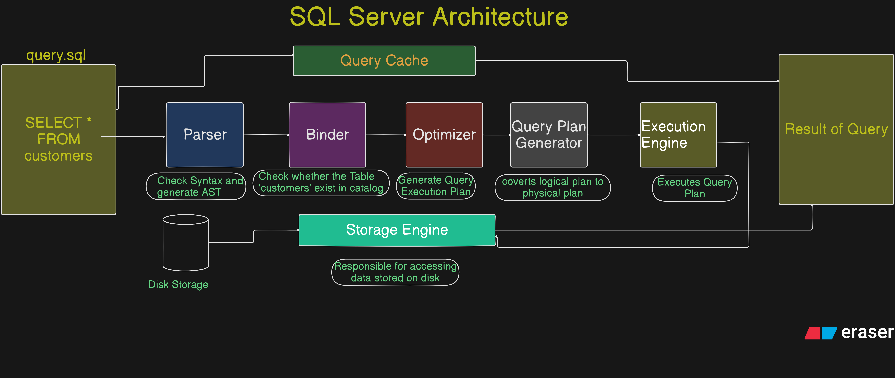

# <span style="color:#a7c957">**Lesson-1 SQL**</span>

## <span style="color:#0a9396">**Introduction to SQL**</span>

---

### 🟩 What is SQL?

**SQL (Structured Query Language)** is a **standard language** used to **communicate with and manipulate relational databases**. It is used for **storing**, **retrieving**, **modifying**, and **managing data** in **Relational Database Management Systems (RDBMS)** such as MySQL, PostgreSQL, Oracle, SQL Server, and SQLite.

> 💡 Developed by IBM in the 1970s (originally SEQUEL), SQL became an ANSI and ISO standard in the 1980s.

---

### 🌟 Features of SQL

| Feature                  | Description                                                       |
| ------------------------ | ----------------------------------------------------------------- |
| **Declarative Language** | Focuses on _what_ to do, not _how_ to do it                       |
| **Portable**             | Works on various platforms and RDBMS                              |
| **Standardized**         | ANSI & ISO standardized with minor vendor-specific changes        |
| **Multi-user Support**   | Can handle many users accessing and modifying data simultaneously |
| **Integration Support**  | Easily integrates with Python, Java, C#, R, etc.                  |
| **Powerful Operations**  | Supports CRUD, DDL, DCL, and TCL commands                         |
| **Secure**               | Can restrict access using roles, privileges, and permissions      |

---

### 📌 Uses of SQL

| Domain                         | Use Case                                                              |
| ------------------------------ | --------------------------------------------------------------------- |
| **Data Analysis**              | Extract and analyze data for insights using SELECT and aggregation    |
| **Data Science**               | Clean, transform, and join datasets before modeling                   |
| **Web Development**            | Backend uses SQL to handle user data, products, orders, etc.          |
| **Database Administration**    | Create schemas, manage permissions, optimize queries                  |
| **Business Intelligence (BI)** | Used in dashboards and reporting tools (Power BI, Tableau)            |
| **ETL Pipelines**              | Extract, transform, and load data for warehouses and big data systems |
| **Cloud Platforms**            | Used in BigQuery, Snowflake, Redshift, Azure Synapse, etc.            |

---

### ✅ Advantages of SQL

| Advantage                 | Description                                                            |
| ------------------------- | ---------------------------------------------------------------------- |
| **Easy to Learn**         | English-like syntax makes it beginner-friendly                         |
| **Efficient**             | Can handle complex queries in a few lines                              |
| **Standardized**          | Works consistently across platforms                                    |
| **Flexible**              | Can query data from multiple tables with JOINs                         |
| **Scalable**              | Can handle large volumes of data                                       |
| **Secure**                | Supports roles, access controls, and permissions                       |
| **Interoperable**         | Works with many languages and BI tools                                 |
| **Transactional Support** | Ensures ACID properties: Atomicity, Consistency, Isolation, Durability |

---

### ❌ Disadvantages of SQL

| Disadvantage                        | Explanation                                                                          |
| ----------------------------------- | ------------------------------------------------------------------------------------ |
| **Limited to Relational Data**      | Not suitable for hierarchical, graph, or NoSQL databases                             |
| **Complex for Very Large Systems**  | Complex queries can become hard to maintain or slow                                  |
| **Vendor Differences**              | SQL dialects differ (MySQL vs Oracle vs SQL Server)                                  |
| **Security Misuse Risk**            | Prone to SQL injection attacks if not used properly                                  |
| **Not Procedural (By Default)**     | Complex logic can be harder to express compared to procedural languages              |
| **Learning Curve for Optimization** | Performance tuning requires deep understanding of indexing, joins, query plans, etc. |

---

## <span style="color:#0a9396">**SQL Architecture**</span>



1. **Architecture Overview**
2. **Functions of Each Component**
3. **Step-by-Step Example with a Table and Query**

---

## 🧠 1. SQL Internal Architecture Overview

```
[SQL Query]
   ↓
🔹 Parser
   ↓
🔹 Binder
   ↓
🔹 Optimizer
   ↓
🔹 Query Plan Generator
   ↓
🔹 Execution Engine
   ↓
🔹 Storage Engine + Buffer Manager
   ↓
[Query Result]
```

---

## 🔧 2. Functions of Each SQL Component

---

### 🔹 1. **Parser**

- **Function:** Converts the raw SQL string into a **parse tree** (abstract syntax tree - AST)
- **Checks:**

  - Syntax errors (`SELECT FROM WHERE` instead of `SELECT ... FROM ... WHERE`)
  - Tokenization (keywords, table names, operators)

✅ **Output:** A structured **parse tree**

---

### 🔹 2. **Binder (Semantic Analyzer)**

- **Function:**

  - Resolves **identifiers** (table names, column names) using metadata (catalog)
  - Validates column existence, type correctness
  - Binds each name in the query to actual **objects in the database**

✅ **Output:** Logical Query Tree with validated names

---

### 🔹 3. **Optimizer**

- **Function:**

  - Chooses the most **efficient** way to execute the query
  - Uses cost-based analysis and **statistics** (table size, index usage)
  - Decides **join order**, **scan type**, **index usage**

✅ **Output:** Optimal **Query Execution Plan (QEP)**

---

### 🔹 4. **Query Plan Generator**

- **Function:**

  - Converts logical plan to a **physical plan**
  - Specifies exact operations: “use index on employees.name”, “do hash join”, etc.

✅ **Output:** Final physical query plan for execution

---

### 🔹 5. **Execution Engine**

- **Function:**

  - Takes the query plan and **executes operations** in sequence
  - Fetches data using iterators (table scan, index scan)
  - Applies filtering (`WHERE`), grouping (`GROUP BY`), sorting (`ORDER BY`)
  - Returns rows

✅ **Output:** Rows in memory ready to be sent to the client

---

### 🔹 6. **Storage Engine**

- **Function:**

  - Responsible for accessing **data stored on disk**
  - Handles page/block management, indexing, and transaction logs

✅ Supports:

- **Table Storage**
- **Index Storage**
- **Transaction Logs (ACID)**

---

### 🔹 7. **Buffer Manager**

- **Function:**

  - Manages in-memory cache of frequently accessed data
  - Reduces disk I/O by **caching pages**, indexes, or result sets

✅ Improves performance

---

### 🔹 8. **Transaction Manager & Concurrency Control**

- **Function:**

  - Ensures **ACID properties**
  - Handles **locks**, **isolation levels**, and **rollback logs**

✅ Prevents conflicts in multi-user systems

---

## 📌 3. Example: Walkthrough with Query

### 🔸 Step 0: Schema & Data

```sql
-- Table
CREATE TABLE employees (
    id INT PRIMARY KEY,
    name VARCHAR(50),
    department VARCHAR(50),
    salary INT
);

-- Sample Data
INSERT INTO employees VALUES (1, 'Alice', 'IT', 80000),
                             (2, 'Bob', 'HR', 60000),
                             (3, 'Eve', 'IT', 90000);
```

### 🔸 Step 1: Example Query

```sql
SELECT name FROM employees WHERE department = 'IT' AND salary > 85000;
```

---

### 🧪 Step-by-Step Execution

| Step                    | What Happens                                                                        |
| ----------------------- | ----------------------------------------------------------------------------------- |
| **Parser**              | Parses query into a syntax tree: identifies SELECT, FROM, WHERE components          |
| **Binder**              | Confirms table `employees` exists, columns `name`, `department`, `salary` are valid |
| **Optimizer**           | Considers whether to use a full table scan or index (if available on `department`)  |
| **Plan Generator**      | Generates plan: → Filter salary > 85000 AND department = 'IT' → Project name        |
| **Execution Engine**    | Fetches rows from `employees`, applies WHERE filter, returns names                  |
| **Storage Engine**      | Reads data pages for `employees` from disk (or from buffer)                         |
| **Buffer Manager**      | If data is cached, reads from memory instead of disk                                |
| **Transaction Manager** | Ensures the read is consistent with isolation level (e.g., Read Committed)          |
| **Result**              | `Eve` is returned to user                                                           |

---

## 🗂️ Optional: Query Plan for Above Example (in PostgreSQL-like format)

```sql
EXPLAIN ANALYZE
SELECT name FROM employees
WHERE department = 'IT' AND salary > 85000;
```

📄 Sample Plan:

```
Seq Scan on employees  (cost=0.00..35.00 rows=1 width=32)
  Filter: ((department = 'IT') AND (salary > 85000))
```

🔍 Meaning:

- A **sequential scan** is used (no index)
- Filters applied at runtime
- Estimate: 1 row matching

---

## 📊 Summary Table of Components

| Component           | Function             | Output              |
| ------------------- | -------------------- | ------------------- |
| Parser              | Syntax check & AST   | Parse Tree          |
| Binder              | Resolves names/types | Logical Tree        |
| Optimizer           | Chooses best plan    | Logical + Cost Plan |
| Plan Generator      | Physical plan        | QEP                 |
| Execution Engine    | Executes plan        | Final result        |
| Storage Engine      | Accesses disk data   | Table/index blocks  |
| Buffer Manager      | Caches data          | Faster access       |
| Transaction Manager | Ensures consistency  | ACID compliance     |

---

## <span style="color:#0a9396">**SQL Keywords**</span>

---

### 🟩 🔤 **Basic SQL Keywords**

| Keyword    | Description                     | Example                                      |
| ---------- | ------------------------------- | -------------------------------------------- |
| `SELECT`   | Retrieves data from a table     | `SELECT name FROM employees;`                |
| `FROM`     | Specifies the table to query    | `SELECT * FROM employees;`                   |
| `WHERE`    | Filters rows based on condition | `WHERE salary > 50000`                       |
| `DISTINCT` | Removes duplicate values        | `SELECT DISTINCT department FROM employees;` |
| `ORDER BY` | Sorts result set (ASC/DESC)     | `ORDER BY salary DESC`                       |
| `LIMIT`    | Limits number of rows returned  | `LIMIT 5`                                    |
| `OFFSET`   | Skips a number of rows          | `OFFSET 10`                                  |

---

### 🧱 **DDL (Data Definition Language)**

| Keyword    | Description                       | Example                              |
| ---------- | --------------------------------- | ------------------------------------ |
| `CREATE`   | Creates tables, databases, etc.   | `CREATE TABLE employees (...);`      |
| `DROP`     | Deletes tables, databases         | `DROP TABLE employees;`              |
| `ALTER`    | Modifies table structure          | `ALTER TABLE employees ADD age INT;` |
| `TRUNCATE` | Removes all rows, resets identity | `TRUNCATE TABLE employees;`          |

---

### ✏️ **DML (Data Manipulation Language)**

| Keyword  | Description            | Example                                             |
| -------- | ---------------------- | --------------------------------------------------- |
| `INSERT` | Adds data to a table   | `INSERT INTO employees VALUES (...);`               |
| `UPDATE` | Modifies existing data | `UPDATE employees SET salary = 60000 WHERE id = 2;` |
| `DELETE` | Deletes rows           | `DELETE FROM employees WHERE id = 3;`               |

---

### 🔐 **DCL (Data Control Language)**

| Keyword  | Description              | Example                                  |
| -------- | ------------------------ | ---------------------------------------- |
| `GRANT`  | Gives user permissions   | `GRANT SELECT ON employees TO user1;`    |
| `REVOKE` | Removes user permissions | `REVOKE SELECT ON employees FROM user1;` |

---

### 🔄 **TCL (Transaction Control Language)**

| Keyword     | Description                  | Example              |
| ----------- | ---------------------------- | -------------------- |
| `COMMIT`    | Saves the transaction        | `COMMIT;`            |
| `ROLLBACK`  | Reverts changes              | `ROLLBACK;`          |
| `SAVEPOINT` | Sets a point to roll back to | `SAVEPOINT point1;`  |
| `BEGIN`     | Begins a transaction         | `BEGIN TRANSACTION;` |

---

### 🔗 **JOINs & Set Operations**

| Keyword      | Description                                | Example                         |
| ------------ | ------------------------------------------ | ------------------------------- |
| `JOIN`       | Combines rows from multiple tables         | `INNER JOIN`, `LEFT JOIN`, etc. |
| `INNER JOIN` | Returns matching rows from both tables     |                                 |
| `LEFT JOIN`  | Returns all from left + matched from right |                                 |
| `RIGHT JOIN` | All from right + matched from left         |                                 |
| `FULL JOIN`  | All rows from both tables                  |                                 |
| `UNION`      | Combines results and removes duplicates    | `UNION`                         |
| `UNION ALL`  | Combines results (with duplicates)         | `UNION ALL`                     |
| `INTERSECT`  | Rows common in both queries                | `INTERSECT`                     |
| `EXCEPT`     | Rows in 1st query not in 2nd               | `EXCEPT`                        |

---

### 📊 **GROUPING & Aggregates**

| Keyword    | Description                          | Example                      |
| ---------- | ------------------------------------ | ---------------------------- |
| `GROUP BY` | Groups rows with same value          | `GROUP BY department`        |
| `HAVING`   | Filters groups (used after GROUP BY) | `HAVING AVG(salary) > 50000` |
| `COUNT()`  | Counts rows                          | `COUNT(*)`                   |
| `SUM()`    | Adds values                          | `SUM(salary)`                |
| `AVG()`    | Calculates average                   | `AVG(salary)`                |
| `MAX()`    | Finds max value                      | `MAX(salary)`                |
| `MIN()`    | Finds min value                      | `MIN(salary)`                |

---

### 🧠 **Advanced / Conditional**

| Keyword       | Description                        | Example                                    |
| ------------- | ---------------------------------- | ------------------------------------------ |
| `CASE`        | Conditional logic (if-then-else)   | `CASE WHEN salary > 50000 THEN 'High' ...` |
| `EXISTS`      | Checks if subquery returns any row | `WHERE EXISTS (SELECT ...)`                |
| `IN`          | Matches a value in a list          | `WHERE department IN ('IT', 'HR')`         |
| `BETWEEN`     | Checks if value is within range    | `WHERE salary BETWEEN 40000 AND 60000`     |
| `LIKE`        | Pattern matching with `%`, `_`     | `WHERE name LIKE 'A%'`                     |
| `IS NULL`     | Checks for NULL                    | `WHERE address IS NULL`                    |
| `IS NOT NULL` | Opposite of IS NULL                |                                            |

---

### 💡 Bonus Keywords

| Keyword          | Description                           | Example                                         |
| ---------------- | ------------------------------------- | ----------------------------------------------- |
| `AS`             | Alias for column/table                | `SELECT name AS employee_name`                  |
| `WITH`           | Common Table Expression (CTE)         | `WITH temp AS (...) SELECT * FROM temp;`        |
| `DEFAULT`        | Sets default value                    | `age INT DEFAULT 25`                            |
| `AUTO_INCREMENT` | Auto-increment primary key            | `id INT AUTO_INCREMENT PRIMARY KEY`             |
| `PRIMARY KEY`    | Declares primary key                  |                                                 |
| `FOREIGN KEY`    | Defines relationship to another table |                                                 |
| `INDEX`          | Improves query performance            | `CREATE INDEX idx_salary ON employees(salary);` |

---

## <span style="color:#0a9396">SQL Administrative and Utility Keywords</span>

---

### ⚙️ 🔑 **SQL Utility and Administrative Keywords**

These keywords are **not part of standard DML/DDL**, but are essential for **database management**, **schema inspection**, and **developer interaction**.

---

### 🔹 1. `USE`

**Purpose**: Sets the current active database to operate on.

```sql
USE employees_db;
```

> After this, all queries run within `employees_db`.

---

### 🔹 2. `SHOW`

**Purpose**: Displays metadata such as databases, tables, columns, variables, etc.

#### Common `SHOW` Statements:

| Statement                       | Purpose                              |
| ------------------------------- | ------------------------------------ |
| `SHOW DATABASES;`               | Lists all databases                  |
| `SHOW TABLES;`                  | Lists all tables in current database |
| `SHOW COLUMNS FROM table_name;` | Lists all columns of a table         |
| `SHOW CREATE TABLE table_name;` | Shows SQL that created a table       |
| `SHOW INDEX FROM table_name;`   | Displays index details               |
| `SHOW VARIABLES;`               | Shows server config variables        |
| `SHOW STATUS;`                  | Shows server status info             |

```sql
SHOW TABLES;
SHOW COLUMNS FROM employees;
```

---

### 🔹 3. `DESCRIBE` / `DESC`

**Purpose**: Displays the **structure/schema** of a table: column names, types, nullability, keys.

```sql
DESCRIBE employees;
-- OR
DESC employees;
```

---

### 🔹 4. `EXPLAIN`

**Purpose**: Shows the **execution plan** for a SQL query — helps in debugging and optimization.

```sql
EXPLAIN SELECT * FROM employees WHERE department = 'IT';
```

✅ Helps analyze:

- Table access method (index/scan)
- Join order
- Filter conditions

---

### 🔹 5. `SET`

**Purpose**: Sets a **session or system variable**.

```sql
SET @x = 100;
SET sql_mode = 'STRICT_ALL_TABLES';
```

---

### 🔹 6. `USE INDEX` / `FORCE INDEX` (MySQL-specific)

**Purpose**: Hints the optimizer to use a specific index.

```sql
SELECT * FROM employees FORCE INDEX (idx_dept)
WHERE department = 'Sales';
```

---

### 🔹 7. `HELP` (MySQL CLI only)

**Purpose**: Get help on SQL syntax.

```sql
HELP SELECT;
```

---

### 🧰 Miscellaneous Admin & Diagnostic Keywords

| Keyword          | Purpose                                   |
| ---------------- | ----------------------------------------- |
| `FLUSH`          | Clear/reset caches, logs                  |
| `RESET`          | Reset counters like replication, status   |
| `ANALYZE TABLE`  | Updates statistics for optimizer          |
| `OPTIMIZE TABLE` | Reorganizes tables to improve performance |
| `RENAME TABLE`   | Renames an existing table                 |
| `ALTER DATABASE` | Change charset/collation of DB            |
| `SHOW WARNINGS`  | Shows non-fatal issues after a query      |

---

### 🔍 Example: Managing a MySQL Session

```sql
-- View all databases
SHOW DATABASES;

-- Use a specific one
USE company_db;

-- Check tables
SHOW TABLES;

-- Describe a table
DESC employees;

-- See the execution plan
EXPLAIN SELECT * FROM employees WHERE salary > 50000;

-- Create a user-defined variable
SET @min_salary = 60000;

-- Use the variable
SELECT * FROM employees WHERE salary > @min_salary;
```

---

### 📌 Notes

- These utility commands are most common in **MySQL** and **MariaDB**.
- **PostgreSQL** and **SQL Server** use slightly different equivalents:

  - PostgreSQL: `\d`, `\dt`, `\l` in `psql` CLI
  - SQL Server: `sp_help`, `sp_who`, `sp_configure`

---

### ✅ Summary Table

| Keyword    | Purpose                   |
| ---------- | ------------------------- |
| `USE`      | Select database           |
| `SHOW`     | List objects or config    |
| `DESCRIBE` | Show table schema         |
| `EXPLAIN`  | Query execution plan      |
| `SET`      | Define variable or config |
| `HELP`     | Get syntax help           |
| `FLUSH`    | Clear logs/caches         |
| `OPTIMIZE` | Rebuild/reorganize table  |
| `RENAME`   | Rename object             |
| `ANALYZE`  | Update statistics         |

---

## <span style="color:#0a9396">**SQL Database Elements**</span>

---

### 🧱 What Are SQL Objects?

**SQL Objects** are **named database structures** that are used to store, organize, manipulate, and control access to data in a relational database.

---

### 🗂️ 1. **Table**

#### 📌 Definition:

A table stores data in **rows (records)** and **columns (attributes)**.

#### ✅ Purpose:

Primary object for storing structured data.

#### 🔤 Syntax:

```sql
CREATE TABLE employees (
    id INT PRIMARY KEY,
    name VARCHAR(100),
    department VARCHAR(50),
    salary DECIMAL(10,2)
);
```

---

### 🔑 2. **View**

#### 📌 Definition:

A **virtual table** created by a `SELECT` query on one or more tables.

#### ✅ Purpose:

- Simplify complex queries
- Provide **restricted views** of data
- Acts like a table but doesn’t store data

#### 🔤 Syntax:

```sql
CREATE VIEW high_salary_employees AS
SELECT name, salary FROM employees WHERE salary > 80000;
```

---

### ⚙️ 3. **Index**

#### 📌 Definition:

A database object that improves **query performance** by allowing faster search.

#### ✅ Purpose:

- Speeds up SELECT queries using WHERE, ORDER BY
- Based on **one or more columns**

#### 🔤 Syntax:

```sql
CREATE INDEX idx_salary ON employees(salary);
```

> 🔍 Note: Too many indexes = slow INSERT/UPDATE.

---

### 🔧 4. **Stored Procedure**

#### 📌 Definition:

A set of precompiled SQL statements stored in the database and executed as a program.

#### ✅ Purpose:

- Encapsulates business logic
- Can take parameters
- Enhances performance via pre-compilation

#### 🔤 Syntax:

```sql
CREATE PROCEDURE GetHighEarners()
BEGIN
  SELECT * FROM employees WHERE salary > 90000;
END;
```

---

### 🔁 5. **Function (User-Defined Function - UDF)**

#### 📌 Definition:

A stored object that returns a **value** and can be used in queries.

#### ✅ Purpose:

- Perform calculations
- Format data
- Can be scalar or table-returning

#### 🔤 Syntax:

```sql
CREATE FUNCTION GetAnnualSalary(monthly_salary DECIMAL)
RETURNS DECIMAL
RETURN monthly_salary * 12;
```

---

### ♻️ 6. **Trigger**

#### 📌 Definition:

A procedure that **automatically executes** in response to certain events on a table (INSERT, UPDATE, DELETE).

#### ✅ Purpose:

- Audit logs
- Data validation or auto-updates

#### 🔤 Syntax:

```sql
CREATE TRIGGER before_insert_employee
BEFORE INSERT ON employees
FOR EACH ROW
SET NEW.created_at = NOW();
```

---

### 🧾 7. **Sequence**

#### 📌 Definition:

Generates a **sequence of unique numbers**, often used for auto-incrementing IDs.

#### ✅ Purpose:

Used to create unique values, especially in multi-user environments.

#### 🔤 Syntax:

```sql
CREATE SEQUENCE emp_id_seq START WITH 1 INCREMENT BY 1;
```

---

### 🔐 8. **Schema**

#### 📌 Definition:

A **logical container** for database objects such as tables, views, procedures, etc.

#### ✅ Purpose:

- Organize database objects
- Control access and structure

#### 🔤 Syntax:

```sql
CREATE SCHEMA hr_schema;
```

> Then you can create tables inside it:
> `CREATE TABLE hr_schema.employees (...);`

---

### 🧳 9. **Synonym (in Oracle/SQL Server)**

#### 📌 Definition:

An alias or alternate name for a database object (like a table, view, or procedure).

#### ✅ Purpose:

- Simplifies object access
- Enables location transparency

#### 🔤 Syntax (Oracle):

```sql
CREATE SYNONYM emp FOR hr_schema.employees;
```

---

### 🧰 10. **Materialized View**

#### ✅ Purpose:

- Improves performance
- Stores snapshot of complex queries
- Can be refreshed periodically

#### 🔤 Syntax (Oracle/Postgres):

```sql
CREATE MATERIALIZED VIEW emp_summary AS
SELECT department, AVG(salary) FROM employees GROUP BY department;
```

---

### 🗝️ 11. **Constraint**

#### ✅ Types:

| Type          | Example                             |
| ------------- | ----------------------------------- |
| `PRIMARY KEY` | Unique + not null                   |
| `FOREIGN KEY` | Enforce relationship between tables |
| `UNIQUE`      | No duplicate values                 |
| `CHECK`       | Validate custom conditions          |
| `NOT NULL`    | Disallow NULLs                      |
| `DEFAULT`     | Assign default value                |

#### 🔤 Syntax:

```sql
CREATE TABLE orders (
  order_id INT PRIMARY KEY,
  amount DECIMAL CHECK (amount > 0)
);
```

---

### 🧵 12. **Cursor**

#### 📌 Definition:

A database object used to **retrieve and manipulate row-by-row results**.

#### ✅ Purpose:

Useful for **procedural logic** where set-based operations don't work.

#### 🔤 Syntax (MySQL):

```sql
DECLARE done INT DEFAULT FALSE;
DECLARE cur CURSOR FOR SELECT name FROM employees;
```

> Note: Avoid cursors if possible; prefer set-based operations.

---

### 📦 13. **Temporary Table**

#### 📌 Definition:

Table created temporarily for a session or query.

#### ✅ Purpose:

- Store intermediate results
- Used in complex calculations or procedures

#### 🔤 Syntax:

```sql
CREATE TEMPORARY TABLE temp_results AS
SELECT * FROM employees WHERE salary > 50000;
```

---

### 🔄 14. **Common Table Expression (CTE)**

#### 📌 Definition:

A **temporary result set** defined using `WITH`, used for breaking down complex queries.

#### ✅ Purpose:

- Increases readability
- Reusable in the main query
- Supports recursion

#### 🔤 Syntax:

```sql
WITH HighEarners AS (
  SELECT name, salary FROM employees WHERE salary > 80000
)
SELECT * FROM HighEarners;
```

---

### 📚 Summary Table

| SQL Object        | Description                       |
| ----------------- | --------------------------------- |
| Table             | Stores data in rows & columns     |
| View              | Virtual table from SELECT         |
| Materialized View | Stores result set of SELECT       |
| Index             | Speeds up data retrieval          |
| Stored Procedure  | Block of precompiled SQL logic    |
| Function (UDF)    | Returns a value (used in queries) |
| Trigger           | Auto-executes on data change      |
| Sequence          | Generates unique numbers          |
| Schema            | Logical container for DB objects  |
| Synonym           | Alias for another object          |
| Constraint        | Ensures data integrity            |
| Cursor            | Row-by-row result handler         |
| Temporary Table   | Short-lived table                 |
| CTE               | Temp result set using WITH        |

---
